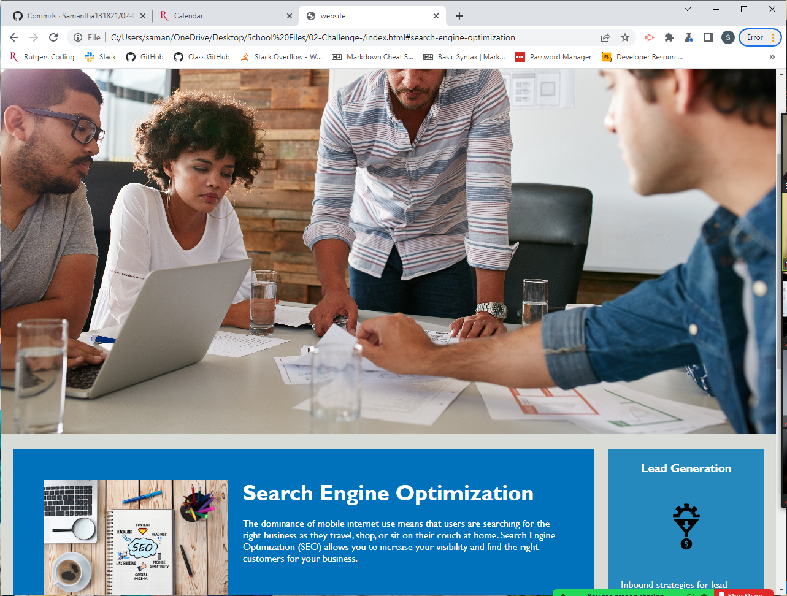

# 02-Challenge-

The Purpose of this assignment was to fix and clean up an already completed web application.

I started off by creating a repo and cloning it to my computer. As changes were made, I then, added, commited, and pushed them to my online repo on GitHub. 

Some changes that were made to the webpage include: fixing the "SEO" link, adding semantic HTML elements, changing the title, and cleaning up the CSS sheet to make it more readable. 

The following image shows an image of the web applications appearance:

The Link to my webpage is :
https://samantha131821.github.io/First-Challenge/

